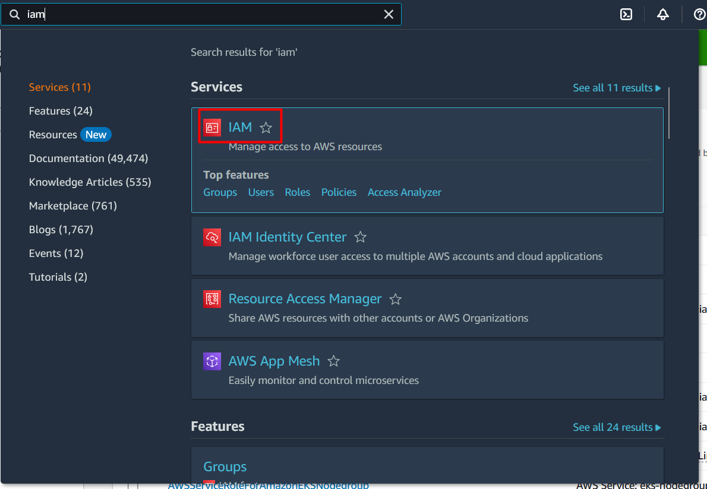
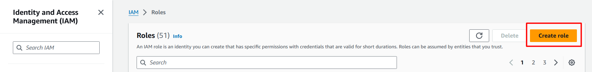
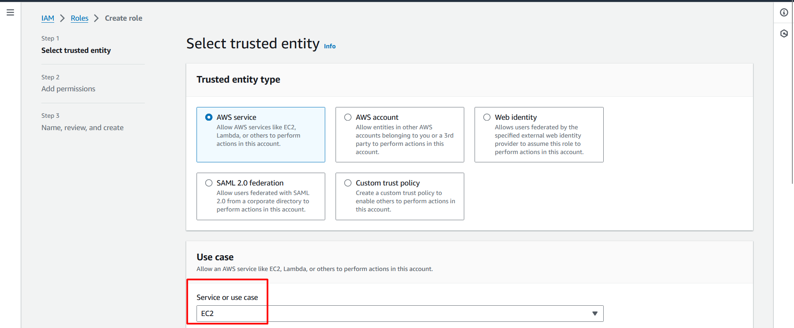
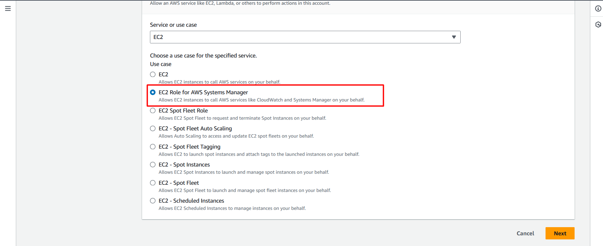
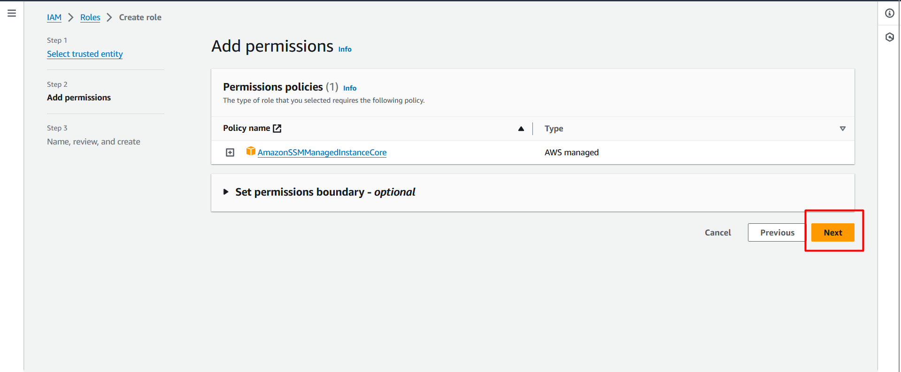
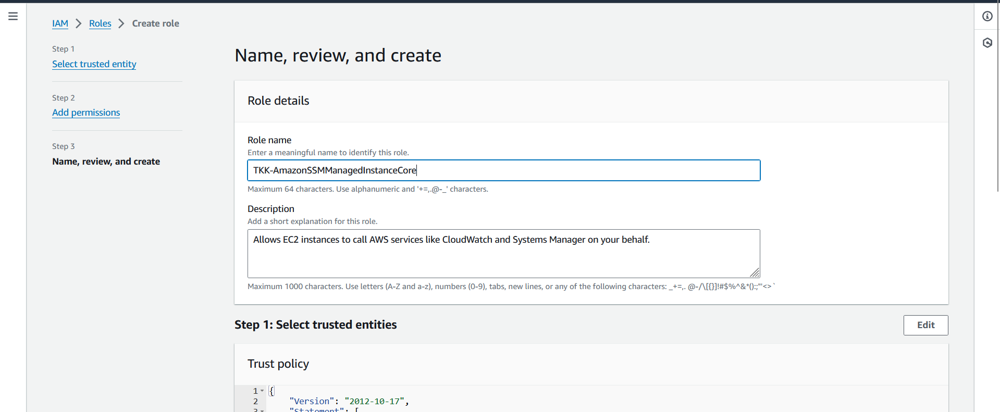
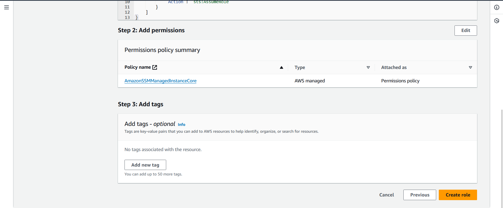
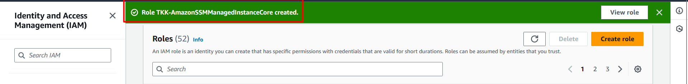

# How-To-Configure-AWS-Systems-Manager-Patch-Manager

### 1. Create IAM Role for System Manager Permissions ###

- Choose `IAM` from AWS Console

- Click `Create Role`

- Choose `EC2`

- Choose `EC2 Role for AWS Systems Manager`
- Click `Next`

- Click `Next`

- Set Role Name `TKK-AmazonSSMManagedInstanceCore`

- Click `Create role`

- Role is created.

### 2. Create Linux Instance ###

- Create Linux Instance by using Ubuntu 22.04 and wait for finished creation.

### 3. Create Window Instance ###

- Create Window Instance by using Window Server 2022 and wait for finished creation.
